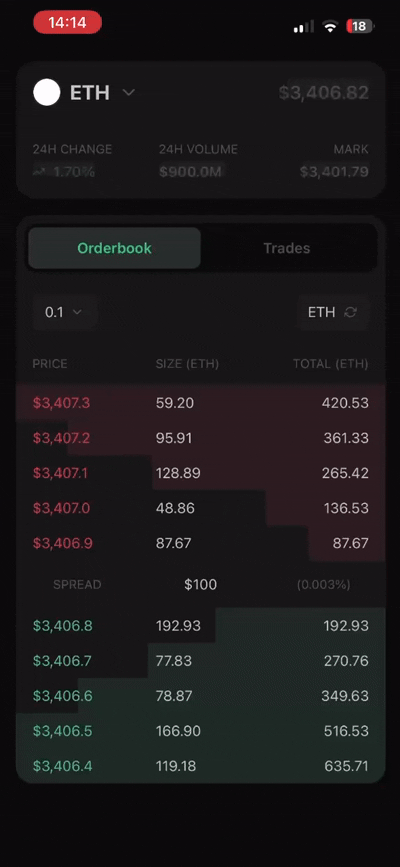

  <h1>Order Book Simulator</h1>

  

    A real-time order book simulation built with React Native,
    focused on rendering performance and a consistent 60 FPS experience.
  

  

  

    Order book simulation running on an iPhone.
  

## About

This project is a small experiment inspired by crypto trading dashboards and
their constantly changing order book interfaces.

The goal was to explore how to optimize a highly dynamic React Native UI with
**dozens of renders per second**, while keeping rendering granular and the
interface consistently smooth at **60 FPS**.

The project uses [Zustand](https://zustand.docs.pmnd.rs/) with separate state
slices to isolate updates to the relevant parts of the UI, combined with
[Reanimated](https://docs.swmansion.com/react-native-reanimated/) for smooth
animations.

## Highlights

- ⚡ **60 FPS** with smooth animations powered by Reanimated
- 🔥 **High-frequency updates** with dozens of updates and renders per second
- ✅ **Granular rendering** to isolate updates to the smallest relevant UI parts
- 🐻 **Zustand state management** with separate `slices` for relevant state domains
- 📊 **Real-time order book** with continuously changing bids and asks
- 🎨 **Custom design tokens** for spacing, typography, colors, and radii
- 📳 **Semantic haptic feedback** through a dedicated abstraction

## Built with

- TypeScript
- React Native
- Expo
- Zustand
- Reanimated
- Expo Haptics

## License

MIT
